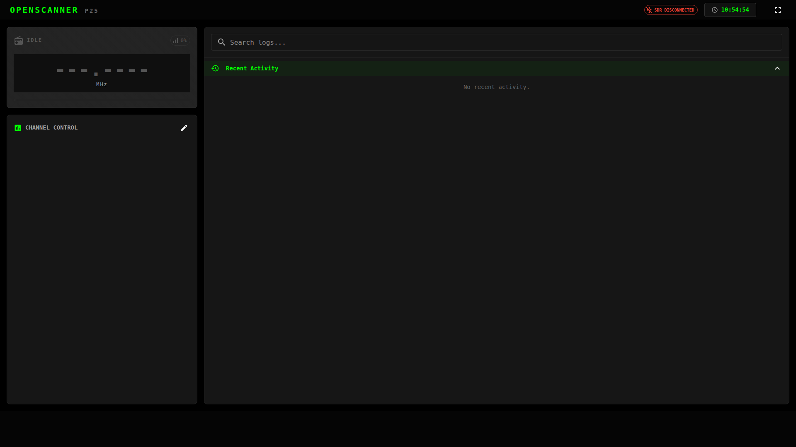

# OpenScanner

OpenScanner is a high-performance, web-based digital radio scanner designed for the Raspberry Pi (optimized for Pi 5). It combines a robust **.NET backend** with a modern **React frontend** to provide real-time P25 digital voice decoding, live spectrum analysis, and AI-powered transcriptions.



## Key Features

- **Digital Voice Decoding**: Stable P25 Phase 1 decoding via `rtl_fm` and `dsd-fme`.
- **AI Transcriptions**: Integrated **Whisper AI** (`whisper.cpp`) for automatic speech-to-text logging.
- **Real-Time Synchronization**: State (locks, holds, status) is synced instantly across all connected browsers.
- **Modern Dashboard**:
    - **Live Waterfall**: Visual scrolling spectrogram of decoded audio.
    - **Transmission History**: Detailed log of calls with instant playback and AI text.
    - **Channel Control**: One-click frequency hold and scan resume.
- **GPS Integration**: Live tracking of location, altitude (Imperial units), and satellite count.
- **Swagger Documentation**: Full OpenAPI/Swagger UI for API exploration.
- **Service-Ready**: Automated installer configures OpenScanner as a systemd service on port 80.

## Hardware Requirements

- **Raspberry Pi**: (Pi 5 highly recommended for Whisper AI performance).
- **RTL-SDR Dongle**: (RTL2832U based, such as RTLSDRv3 or v4).
- **GPS Receiver**: (Optional, any USB GPS receiver compatible with `gpsd`).
- **Antenna**: Tuned for your local 150-800MHz public safety bands.

## Quick Start

### 1. Install Hardware Drivers
Ensure your Pi has the necessary radio tools installed. You can use the included `install_dsd.sh` if you are starting from a clean OS:
```bash
chmod +x install_dsd.sh
./install_dsd.sh
```

### 2. Deploy OpenScanner
The unified installer builds the .NET backend, the React frontend, and sets up Whisper AI:
```bash
chmod +x install_service.sh
sudo ./install_service.sh
```

### 3. Access the UI
Once installed, open your browser to:
`http://<your-pi-ip>`

For API documentation, visit:
`http://<your-pi-ip>/swagger`

## Management

- **Status Check**: `systemctl status openscanner`
- **View Logs**: `journalctl -u openscanner -f`
- **Data Location**: Database and recordings are stored in the `/data` directory in the project root.

## Acknowledgments

- [DSD-FME](https://github.com/lwvmobile/dsd-fme): Digital voice decoding.
- [whisper.cpp](https://github.com/ggerganov/whisper.cpp): High-performance local AI transcription.
- [FftSharp](https://github.com/swharden/FftSharp): Fast FFT calculations for the live spectrum.
- [NSwag](https://github.com/RicoSuter/NSwag): OpenAPI/Swagger integration.
